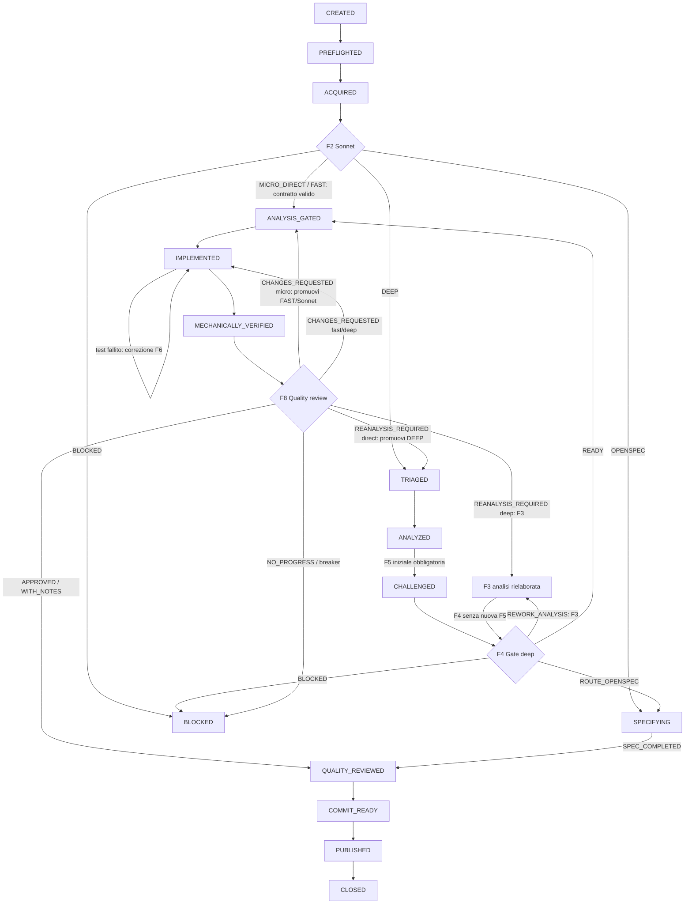

# GitHub Issue Workflow V2 — Specifica Operativa

> Specifica operativa e deterministica per la gestione autonoma end-to-end di una GitHub
> issue da parte di un orchestratore a sessione fissa.
>
> - Documento originale (narrativo): [`github-issue-ai-workflow.md`](github-issue-ai-workflow.md).
>   Resta la fonte per motivazioni, best practice, dettagli di invocazione sicura dei client
>   e miglioramento continuo. Questa specifica ne è la versione eseguibile.
> - Percorso di specifica: [`openspec-workflow-v2.md`](openspec-workflow-v2.md).
> - Stato: workflow operativo adottato il 2026-07-14. Per le nuove run GitHub questa
>   specifica prevale sulla guida narrativa; ogni conflitto va registrato come difetto
>   documentale da correggere.

## 1. Oggetto E Uso Del Documento

Definisce: stati, transizioni, fasi, contratti input/output, gate decisionali, limiti
numerici, protezioni meccaniche e criteri di completamento del flusso
"issue → codice verificato → pubblicazione → chiusura".

Non definisce: motivazioni, sintassi di invocazione dei client (restano nel documento
originale), regole specifiche di un repository (che vivono nel profilo di progetto, §5).

Uso da parte dell'orchestratore: per determinare o riprendere la fase corrente si leggono il
profilo risolto (§5) e stato, transizioni e ripresa (§7). Per eseguire la fase si leggono la
relativa sottosezione (§9), il contratto dell'artefatto coinvolto (§17), i limiti applicabili
(§11–§13) e le sole regole che questi testi richiamano per nome o riferimento (per esempio
V-OUT §2.2, sospensioni §10 o protezioni §14). Non occorre assimilare ogni volta l'intero
documento: la sezione di fase è il punto d'ingresso operativo e le regole richiamate restano
normative.

## 2. Convenzioni E Validazione Degli Output

- `MAIUSCOLO` = stati ed esiti appartenenti a enum chiusi. Un valore fuori enum è un output
  non conforme.
- "orchestratore" = la sessione di coordinamento a modello fisso (§3.1).
- "agente" = sessione esterna effimera invocata per una singola fase e mai riutilizzata per
  ruoli o fasi diverse.
- "deve" = obbligo verificabile; la violazione rende la fase fallita.
- `<base>` = `github-OWNER-REPO-NUMBER`, prefisso comune degli artefatti della issue.
- I prompt di invocazione sono brevi: indicano input, contratto e percorso dell'output; non
  duplicano regole già scritte nella skill o in questa specifica.

### 2.1 Blocco Esito

Ogni artefatto prodotto da una fase inizia con un blocco recintato di sole righe
`chiave: valore`, una per riga, con le chiavi fissate dal contratto della fase (§17):

```text
fase: triage
esito: FAST
iterazione: 1
data: <AAAA-MM-GG>
```

### 2.2 Validazione V-OUT

L'orchestratore applica questa checklist a ogni output delegato:

1. il processo dell'agente è terminato con un output osservabile;
2. esiste il solo artefatto atteso nel percorso atteso (per l'implementazione: il diff più
   il report previsto);
3. il blocco esito è presente con tutte le chiavi richieste dal contratto;
4. `esito` appartiene all'enum della fase e rispetta le restrizioni di validità del percorso
   corrente (§9);
5. per l'implementazione, `modello`, `effort` e `ultracode` coincidono con i metadati
   dell'invocazione registrati dall'orchestratore prima dell'avvio;
6. le sezioni obbligatorie del contratto sono presenti e non vuote;
7. `git status --short` non mostra modifiche fuori dai permessi della fase;
8. il budget righe (§6) è rispettato — soft: il superamento produce un warning registrato,
   non un blocco.

Se V-OUT fallisce: 1 retry tecnico con istruzioni ristrette; al secondo fallimento si
applica la transizione di errore della fase (§15). L'orchestratore non corregge, non
completa e non interpreta un output non conforme.

Prima di ogni transizione positiva successiva a una delega, l'orchestratore registra nella
voce di fase di `<base>.metrics.source.json` l'esito meccanico di V-OUT: chiavi richieste,
chiavi mancanti, validita' dell'enum, completezza delle sezioni, controllo di scope e,
quando applicabile, corrispondenza dei metadati di invocazione. La transizione e' vietata se
`output_validation.status` non e' `passed`; un report apparentemente utile ma incompleto o
con metadati difformi resta un output non conforme.

## 3. Ruoli, Sessioni E Modelli

### 3.1 Sessione Fissa Dell'Orchestratore

L'orchestratore apre la sessione con GPT-5.6 Luna effort `xhigh` e la mantiene invariata
dall'inizio allo stato terminale della run, compresi i sottoworkflow (percorso OpenSpec).
Ogni delega apre una sessione esterna nuova ed effimera; nessuna delega modifica modello o
effort dell'orchestratore.

### 3.2 Ruoli

| Ruolo | Esecutore | Fasi | Scrive |
|-------|-----------|------|--------|
| Orchestratore | GPT-5.6 Luna `xhigh`, sessione fissa | F0, F1, F7, F9, F10, F11, coordinamento | `.preflight.source.json`, `.verification.source.json`, `.dry-run.md` |
| Triage e analisi rapida | Sonnet 5 | F2 per `MICRO_DIRECT` e `FAST`; triage per `DEEP` | `.triage.md` |
| Analista approfondito | Claude (§3.4) | F3 solo `DEEP` o dopo promozione | `.analysis.md` |
| Controanalista | GPT-5.6 Sol | F5 | `.counter-analysis.md` |
| Gate dell'analisi approfondita | GPT-5.6 Terra | F4 solo `DEEP` | `.analysis-gate.md` |
| Implementatore | Haiku 4.5 (`MICRO_DIRECT`), Sonnet 5 (`FAST`/`DEEP`) | F6 | codice, test, `.implementation.md` |
| Quality reviewer | GPT-5.6 Terra | F8 | `.review.md` |

### 3.3 Routing Modelli Ed Effort

| Fase | Micro Direct | Fast | Deep |
|------|--------------|------|------|
| Triage / analisi rapida (F2) | Sonnet 5 `high` | Sonnet 5 `high` | Sonnet 5 `high` |
| Analisi approfondita (F3) | — | — | Claude §3.4, effort massimo |
| Controanalisi (F5) | — | — | Sol `ultra` (obbligatoria) |
| Gate dell'analisi (F4) | — | — | Terra `xhigh` |
| Implementazione (F6) | Haiku 4.5 `high`, senza Ultracode | Sonnet 5 `high`, senza Ultracode | Sonnet 5 effort massimo, Ultracode quando la decomposizione porta vantaggio |
| Quality review (F8) | Terra `high` | Terra `high` | Terra `xhigh` |

### 3.4 Politica Temporale Dell'Analisi

| Periodo | Modello per analisi `DEEP` e authoring OpenSpec |
|---------|------------------------------------------|
| Fino al 19 luglio 2026 incluso | Fable |
| Dal 20 luglio 2026 | Opus 4.8 |

La data si valuta con la data locale dell'ambiente all'avvio di ogni nuova invocazione di
analisi approfondita o authoring. Un'invocazione già iniziata non cambia modello a metà
esecuzione. L'analisi compatta dei percorsi `MICRO_DIRECT` e `FAST` è parte di F2 e usa
sempre Sonnet 5 secondo §3.3.

### 3.5 Adapter Di Delega, Modelli Ed Effort

Un adapter di delega è la configurazione di progetto che collega un ruolo a un client
eseguibile o a una sessione esterna: identifica client, verifica tecnica, mappa modelli ed
effort, imposta working directory e permessi della fase, raccoglie l'output e restituisce i
metadati di invocazione. Il profilo (§5) deve dichiarare ogni adapter usato dalla run; il
workflow non presume che un modello visibile in un'interfaccia sia invocabile
dall'orchestratore.

F0 verifica soltanto che gli adapter registrati siano raggiungibili e autenticati quando
necessario, senza richiedere tutti i modelli dei percorsi non ancora scelti. Immediatamente
prima di ogni invocazione delegata l'orchestratore risolve l'adapter della fase e verifica
modello ed effort effettivamente richiesti. Adapter, modello o effort non disponibili →
`BLOCKED_ENVIRONMENT` nella fase interessata, senza sostituzioni automatiche. Ultracode si
attiva solo con il meccanismo concreto esposto dal client; `ultracode` non è un valore di
`--effort`.

Prima di avviare un processo, l'orchestratore costruisce e valida un *envelope di
invocazione* con: `run_id`, fase, ruolo, adapter, checkout o worktree, modello, effort,
permessi della fase, riferimenti agli input, prompt testuale non vuoto, output atteso,
timeout e destinazione locale per stdout, stderr e metadati. L'adapter riceve l'envelope,
non una stringa di shell costruita per interpolazione. Cattura codice di uscita, stdout e
stderr; l'orchestratore valida l'output contro il contratto V-OUT e soltanto allora scrive o
aggiorna l'artefatto di fase.

Un prompt assente o vuoto, un input mancante o un output atteso non autorizzato è un errore
locale `ADAPTER_INPUT_INVALID`: non si avvia il client, non si incrementa il tentativo della
fase e non si registra un'invocazione del modello. La run passa a `BLOCKED_ENVIRONMENT` fino
alla correzione dell'envelope, poi riprende dalla stessa fase. Gli artefatti locali di debug
restano fuori da Git e non contengono segreti.

## 4. Confini Dell'Orchestratore

Esegue direttamente (azioni deterministiche):

- risoluzione del profilo di progetto e preflight;
- risoluzione e verifica degli adapter di delega;
- acquisizione della issue con la skill di intake;
- validazione V-OUT e controllo delle restrizioni di validità degli esiti;
- avvio, monitoraggio, timeout e terminazione verificata degli agenti;
- comandi Git di lettura, staging esplicito, commit, push;
- esecuzione dei comandi di verifica autorizzati (test, build, lint, evidenze UI);
- confronto hash delle risorse protette e controllo delle modifiche preesistenti;
- conteggio di retry, rework, correzioni e applicazione delle transizioni definite;
- commento e chiusura della issue dopo i gate previsti.

Delega sempre (giudizi semantici):

- routing e contratto diretto nei percorsi `MICRO_DIRECT`/`FAST` (F2);
- validità tecnica del piano e risoluzione delle divergenze tra analisti nel solo `DEEP` (F4);
- messa alla prova indipendente dell'analisi (F5);
- scrittura del codice (F6);
- valutazione semantica dell'implementazione e review (F8).

Regola di sostituzione: se un output delegato è assente, malformato o inconcludente,
l'orchestratore non lo sostituisce con una propria valutazione. Esegue il retry consentito
oppure applica la transizione di errore.

Osservabilità: l'orchestratore sintetizza gli eventi di stato degli stream (avanzamento,
tool call, errori, richieste di permesso); non riversa gli stream integrali nel contesto o
negli artefatti.

Richieste di permesso degli agenti: approvabili solo se necessarie alla fase, dentro le
directory autorizzate, reversibili o coperte da Git, senza esposizione di segreti, senza
alterazione di dati persistenti e senza effetti esterni non previsti dal workflow. Ogni
altra richiesta viene rifiutata; se blocca la fase, si applica la transizione di errore.

## 5. Profilo Di Progetto

Input obbligatorio della run, esterno a questa specifica. Per questo repository il profilo
vigente è [`ai-workflow-project-profile.md`](ai-workflow-project-profile.md). Chiavi minime:

| Chiave | Contenuto | Usata in |
|--------|-----------|----------|
| `directory_autorizzate` | radici entro cui leggere e scrivere | tutte |
| `branch_atteso`, `remote_atteso` | politica Git della run live | F0, F9, F10 |
| `directory_artefatti` | posizione degli artefatti di issue (convenzione: `docs/work-items/github-issues/`) | tutte |
| `risorse_protette` | file persistenti da non alterare (es. database locali con dati reali) | F0, F7, F9 |
| `comandi_verifica` | build, test, lint, type-check per area | F7 |
| `comandi_ui` | procedura browser/preview per le evidenze UI | F7 |
| `canale_github` | modalità autenticata di lettura e scrittura della issue | F0, F1, F11 |
| `adapter_delega` | client, mapping modello/effort, verifica e vincoli di invocazione per ruolo | F0, fasi delegate |
| `timeout_override` | eventuali valori per ruolo/effort | §12 |
| `budget_override` | eventuali budget artefatti | §6 |

Se una chiave necessaria alla fase corrente manca o non è risolvibile →
`BLOCKED_ENVIRONMENT`.

## 6. Artefatti

Directory: `directory_artefatti` del profilo. Prefisso comune `<base>`.

| Artefatto | Autore | Versionamento | Contratto |
|-----------|--------|---------------|-----------|
| `<base>.source.json` | intake | locale, mai committato | §17.1 |
| `<base>.preflight.source.json` | orchestratore | locale, mai committato | §17.2 |
| `<base>.task.md` | intake | committato | §17.3 |
| `<base>.triage.md` | triage | committato | §17.4 |
| `<base>.analysis.md` | analista | committato | §17.5 |
| `<base>.counter-analysis.md` | controanalista | committato quando prodotto | §17.6 |
| `<base>.analysis-gate.md` | gate dell'analisi | committato | §17.7 |
| `<base>.implementation.md` | implementatore | committato | §17.8 |
| `<base>.review.md` | quality reviewer | committato | §17.9 |
| `<base>.dry-run.md` | orchestratore | solo nelle simulazioni | §17.10 |
| `<base>.metrics.source.json` | orchestratore | locale, mai committato | §17.11 |
| `<base>.verification.source.json` | orchestratore | locale, mai committato | §17.12 |

I file locali usano il suffisso `.source.json` per rientrare nella regola di esclusione Git
già prevista dal repository per i dati locali di run.

Il V2 non produce `.verification.md`: i controlli meccanici sono eseguiti
dall'orchestratore (F7), registrati nel manifest locale strutturato e la valutazione
semantica confluisce nella quality review (F8).

Budget righe (soft: il superamento produce un warning, mai un blocco; non è un criterio di
accettazione):

| Task | Triage | Analisi | Controanalisi | Gate analisi | Implementazione | Review |
|------|--------|---------|---------------|--------------|-----------------|--------|
| 100 | 110 | 120 | 100 | 80 | 80 | 120 |

Iterazioni: quando una fase viene rieseguita, l'artefatto viene sovrascritto e deve
riportare `iterazione: n` nel blocco esito e una sezione `Storico` con una riga per ogni
iterazione precedente (`iterazione | data | esito | trigger`). Gli artefatti contengono
decisioni ed evidenze; non ricopiano task, codice o documenti già disponibili. Il contratto
della review (§17.9) aggiunge allo storico i campi necessari a ricostruire una promozione.

Telemetria: l'orchestratore inizializza `<base>.metrics.source.json` al preflight e lo
aggiorna dopo ogni fase o invocazione delegata terminata, anche se fallita o bloccata. Il file
serve a valutare routing, costo e qualità delle run; non è un artefatto di decisione e non
viene passato agli agenti come contesto di lavoro.

## 7. Stati, Transizioni E Ripresa

### 7.1 Stati

Avanzamento (ordine nominale):

```text
CREATED -> PREFLIGHTED -> ACQUIRED -> [TRIAGED -> ANALYZED -> CHALLENGED]
        -> ANALYSIS_GATED -> IMPLEMENTED -> MECHANICALLY_VERIFIED
        -> QUALITY_REVIEWED -> COMMIT_READY -> PUBLISHED -> CLOSED
```

Controllo:

| Stato | Semantica | Ripresa |
|-------|-----------|---------|
| `SPECIFYING` | sottoworkflow OpenSpec in corso (run figlia) | all'esito della figlia |
| `WAITING_DECISION` | serve una decisione del committente | dopo la decisione registrata (§10) |
| `BLOCKED_ENVIRONMENT` | prerequisito tecnico mancante | dopo la correzione dell'ambiente |
| `PUBLISH_FAILED` | commit locale valido, pubblicazione da riprendere | recovery idempotente (F10/F11) |
| `BLOCKED` | automazione terminata senza ulteriori retry | terminale per l'automazione; ogni rilancio è una decisione del committente |
| `DRY_RUN_COMPLETED` | simulazione completata senza effetti remoti | terminale |
| `CLOSED` | issue chiusa dopo push verificato | terminale |

### 7.2 Transizioni

| Da | Evento / esito | A |
|----|----------------|---|
| `CREATED` | preflight superato (F0) | `PREFLIGHTED` |
| qualunque | prerequisito tecnico mancante | `BLOCKED_ENVIRONMENT` |
| `PREFLIGHTED` | intake completato (F1) | `ACQUIRED` |
| `ACQUIRED` | F2 `MICRO_DIRECT` o `FAST` con contratto diretto valido | `ANALYSIS_GATED` |
| `ACQUIRED` | triage `DEEP` (F2) | `TRIAGED` (route registrato) |
| `ACQUIRED` | triage `OPENSPEC` | `SPECIFYING` (run figlia OpenSpec V2) |
| `ACQUIRED` | triage `BLOCKED` | `BLOCKED` o `WAITING_DECISION` per `tipo_blocco` (§10) |
| `TRIAGED` | analisi prodotta (F3) | `ANALYZED` |
| `ANALYZED` (deep, controanalisi mai eseguita nella run) | controanalisi iniziale obbligatoria prodotta (F5) | `CHALLENGED` |
| `ANALYZED` / `CHALLENGED` | gate `READY` (F4, solo deep) | `ANALYSIS_GATED` |
| `ANALYZED` / `CHALLENGED` | gate `REWORK_ANALYSIS`, rework disponibile | F3 → `ANALYZED`/`CHALLENGED` secondo F3, poi F4 senza nuova F5 |
| `ANALYZED` / `CHALLENGED` | gate `ROUTE_OPENSPEC` | `SPECIFYING` |
| `ANALYZED` / `CHALLENGED` | gate `BLOCKED` | `BLOCKED` o `WAITING_DECISION` per `tipo_blocco` |
| `ANALYSIS_GATED` | implementazione `DONE` (F6) | `IMPLEMENTED` |
| `ANALYSIS_GATED` | implementazione `NEEDS_DECISION` | `WAITING_DECISION` |
| `IMPLEMENTED` | controlli meccanici superati (F7) | `MECHANICALLY_VERIFIED` |
| `IMPLEMENTED` | test fallito per codice, correzione disponibile (§13) | F6 → `IMPLEMENTED` |
| `MECHANICALLY_VERIFIED` | review `APPROVED` / `APPROVED_WITH_NOTES` (F8) | `QUALITY_REVIEWED` |
| `MECHANICALLY_VERIFIED` (`MICRO_DIRECT`) | review `CHANGES_REQUESTED` con `promozione_percorso: micro_to_fast`, correzione disponibile | promuovi a `FAST` → F6 con Sonnet 5 → `IMPLEMENTED` |
| `MECHANICALLY_VERIFIED` (`FAST`/`DEEP`) | review `CHANGES_REQUESTED`, correzione disponibile | F6 → `IMPLEMENTED` |
| `MECHANICALLY_VERIFIED` (deep) | review `REANALYSIS_REQUIRED`, budget disponibili | F3 → `ANALYZED`/`CHALLENGED` secondo F3, poi F4 senza nuova F5 |
| `MECHANICALLY_VERIFIED` (`MICRO_DIRECT`/`FAST`) | review `REANALYSIS_REQUIRED` con `promozione_percorso: direct_to_deep`, budget disponibili | promuovi a `DEEP` → F3 → F5 → F4 |
| `MECHANICALLY_VERIFIED` | review `NO_PROGRESS` o circuit breaker (§11) | `BLOCKED` |
| `QUALITY_REVIEWED` | gate di pubblicazione superato (F9) | `COMMIT_READY` |
| `COMMIT_READY` | commit e push riusciti (F10) | `PUBLISHED` |
| `COMMIT_READY` / `PUBLISHED` | push, commento o chiusura falliti | `PUBLISH_FAILED` |
| `PUBLISHED` | commento e chiusura riusciti (F11) | `CLOSED` |
| `SPECIFYING` | figlia `SPEC_COMPLETED` | `QUALITY_REVIEWED` (poi F9) |
| `SPECIFYING` | figlia `WAITING_DECISION` / `BLOCKED_ENVIRONMENT` / `BLOCKED` | stato omologo del parent |
| `COMMIT_READY` (dry-run) | verifica assenza effetti remoti (§16) | `DRY_RUN_COMPLETED` |

Diagramma illustrativo (le tabelle sono normative):



### 7.3 Derivazione Dello Stato E Ripresa

Lo stato di una run si deriva da artefatti, Git e stato remoto; i contatori si leggono dal
blocco esito più recente di ogni artefatto. Una run interrotta riprende dallo stato
derivato, con nuove invocazioni effimere; non dipende dalla sessione precedente.
L'iterazione dell'analisi corrente è quella di `<base>.analysis.md`; un gate è relativo a
quell'analisi solo quando `analisi_iterazione_valutata` (§17.7) coincide. La review registra
separatamente l'iterazione ricevuta (§17.9), così il suo esito resta associato all'analisi
effettivamente valutata.

| Osservazione | Stato derivato | Riprendi da |
|--------------|----------------|-------------|
| nessun artefatto | `CREATED` | F0 |
| preflight valido, nessun task | `PREFLIGHTED` | F1 |
| task presente, nessun triage | `ACQUIRED` | F2 |
| triage `MICRO_DIRECT`/`FAST` con contratto diretto valido, nessun diff/report | `ANALYSIS_GATED` | F6 |
| triage `DEEP`, nessuna analisi | `TRIAGED` | F3 |
| triage `OPENSPEC` | `SPECIFYING` | derivazione della run figlia (OpenSpec V2 §5) |
| analisi deep presente, controanalisi assente | `ANALYZED` | F5 `ultra` |
| analisi deep e controanalisi presenti, nessun gate relativo all'analisi corrente | `CHALLENGED` | F4 |
| ultimo gate relativo all'analisi corrente `REWORK_ANALYSIS` | `ANALYZED` / `CHALLENGED` | F3 |
| ultima review `CHANGES_REQUESTED` con `route_valutata: MICRO_DIRECT` e `promozione_percorso: micro_to_fast`, record promozione coerente, nessuna correzione successiva | `ANALYSIS_GATED` (route promossa a `FAST`) | F6 con Sonnet 5 |
| ultima review `REANALYSIS_REQUIRED` in route `DEEP`; `analisi_iterazione_valutata` della review uguale all'analisi corrente | `MECHANICALLY_VERIFIED` | F3 |
| ultima review `REANALYSIS_REQUIRED` con `route_valutata: MICRO_DIRECT|FAST` e `promozione_percorso: direct_to_deep`, record promozione coerente | `TRIAGED` (route promossa a `DEEP`) | F3 |
| gate `READY` relativo all'analisi corrente; ultima review `REANALYSIS_REQUIRED` relativa a un'analisi precedente; nessuna implementazione con `correzione` successiva a `correzione_valutata` della review | `ANALYSIS_GATED` | F6 come correzione |
| gate `READY` con `analisi_iterazione_valutata` uguale all'analisi corrente, nessun diff/report | `ANALYSIS_GATED` | F6 |
| report `DONE`, nessuna review per la correzione corrente | `IMPLEMENTED` | F7 (i controlli meccanici si rieseguono sempre) |
| review `APPROVED`/`APPROVED_WITH_NOTES`, nessun commit di run | `QUALITY_REVIEWED` | F9 |
| commit locale presente, push assente | `PUBLISH_FAILED` pendente | F10 (verifica idempotente) |
| push presente, issue aperta | `PUBLISHED` | F11 |
| issue chiusa | `CLOSED` | — |
| ultimo esito con decisione richiesta | `WAITING_DECISION` | fase sollevante, dopo la decisione (§10) |

Regole di ripresa: prima azione = preflight ridotto (stato Git, hash risorse protette,
canale GitHub); i controlli meccanici (F7) si rieseguono sempre. Una promozione è valida
in ripresa solo se il record nella telemetria corrisponde alla review e al suo storico
(iterazione, route, tipo e hash del contenuto); artefatti incoerenti o stato non derivabile
→ `BLOCKED`, nessuna ricostruzione inventata.

## 8. Percorsi Di Esecuzione

### 8.1 Routing (deciso solo dal triage F2)

| Esito | Criteri |
|-------|---------|
| `MICRO_DIRECT` | tutte vere: causa dimostrata nel codice; un solo file o una modifica meccanica equivalente; diff atteso univoco e reversibile; nessun dato, API, schema, dipendenza, sicurezza o decisione UX aperta; verifiche eseguibili con strumenti già presenti. Se anche una condizione è incerta, non è valido |
| `FAST` | issue chiara senza decisioni di prodotto aperte; modifica locale e reversibile; nessun cambio di schema dati, contratto API o architettura; pochi file plausibilmente coinvolti; rischio basso; test e verifiche identificabili. F2 deve inoltre chiudere le domande tecniche risolvibili e produrre il contratto diretto §17.4 |
| `DEEP` | rischio medio-alto, multi-modulo, architetturale, difficile da verificare o con decisioni tecniche controverse — ma con requisiti e design già determinati |
| `OPENSPEC` | serve costruire la specifica prima del codice: nuovo concetto di dominio; decisioni coordinate dati/API/UI; alternative architetturali valide; scomposizione in incrementi dipendenti; requisiti osservabili da formalizzare. Una migration piccola e chiaramente richiesta non impone da sola OpenSpec |
| `BLOCKED` | manca una condizione essenziale non risolvibile da issue, commenti, codebase o ricerca |

### 8.2 Sequenze

Micro direct:

```text
F0 -> F1 -> F2 (Sonnet 5 high, contratto diretto) -> F6 (Haiku 4.5 high)
   -> F7 -> F8 (Terra high) -> F9 -> F10 -> F11
```

Fast:

```text
F0 -> F1 -> F2 (Sonnet 5 high, analisi compatta e contratto diretto)
   -> F6 (Sonnet 5 high) -> F7 -> F8 (Terra high) -> F9 -> F10 -> F11
```

Deep:

```text
F0 -> F1 -> F2 (Sonnet 5 high) -> F3 (Claude massimo) -> F5 (Sol ultra, obbligatoria) -> F4 (Terra xhigh)
   -> F6 (Sonnet massimo) -> F7 -> F8 (Terra xhigh) -> F9 -> F10 -> F11
```

Le sequenze descrivono la prima discesa. Un `CHANGES_REQUESTED` in `MICRO_DIRECT` promuove
la correzione a `FAST`; un `REANALYSIS_REQUIRED` in `MICRO_DIRECT` o `FAST` promuove la run
a `DEEP`. I rientri deep in F3 procedono direttamente a F4 senza ripetere F5.

OpenSpec:

```text
F0 -> F1 -> F2 -> SPECIFYING (run figlia: openspec-workflow-v2.md) -> F9 -> F10 -> F11
```

### 8.3 Promozioni Di Percorso

#### 8.3.1 `MICRO_DIRECT` → `FAST`

- Richiedibile solo dalla quality review F8 con esito `CHANGES_REQUESTED` e
  `promozione_percorso: micro_to_fast`; una sola volta per run.
- Significato: il contratto diretto resta valido, ma l'implementazione Haiku non soddisfa il
  review gate. Non si invoca F3, F4 o F5.
- Effetti: `route = FAST`; la correzione in F6 usa Sonnet 5 `high` senza Ultracode, consuma
  una correzione e conserva contratto, test ed evidenze già validi. Il downgrade a
  `MICRO_DIRECT` è vietato.
- Prima di F6, l'orchestratore aggiorna `route` e aggiunge la promozione alla telemetria.
  Il record conserva iterazione e hash del contenuto della review, route valutata, tipo e destinazione;
  deve coincidere con `promozione_percorso` e `route_valutata` della review, che restano
  disponibili anche nello storico dopo le iterazioni successive.

#### 8.3.2 `MICRO_DIRECT`/`FAST` → `DEEP`

- Richiedibile solo dalla quality review F8 con esito `REANALYSIS_REQUIRED` e
  `promozione_percorso: direct_to_deep`; una sola volta per run; il downgrade `DEEP → FAST`
  è vietato.
- Effetti: `route = DEEP` in modo irreversibile; i limiti diventano quelli deep senza
  azzerare i contatori già consumati; F3, F5 e F4 vengono eseguiti nell'ordine previsto dal
  deep. Il contratto diretto resta evidenza storica ma non autorizza ulteriori modifiche.
- Prima di F3, l'orchestratore aggiorna `route` e aggiunge la promozione alla telemetria.
  Il record conserva iterazione e hash del contenuto della review, route valutata, tipo e destinazione;
  deve coincidere con `promozione_percorso` e `route_valutata` della review, che restano
  disponibili anche nello storico dopo le iterazioni successive.

## 9. Fasi Operative

### F0 — Preflight

- Transizione: `CREATED` → `PREFLIGHTED`.
- Esecutore: orchestratore.
- Input: profilo di progetto, checkout locale.
- Azioni (checklist, tutte):
  1. risolvere il profilo di progetto; chiavi necessarie presenti;
  2. verificare root e remote attesi; per una run live il branch corrente deve essere
     `branch_atteso`, per una dry-run deve essere un branch o worktree locale isolato;
     registrare `modalita_run`, `branch_run` e commit base;
  3. `git status --short`: registrare l'elenco delle modifiche preesistenti (non
     attribuibili alla run, mai da includere nello staging);
  4. se esistono artefatti della stessa issue con stato derivato non terminale → procedura
     di ripresa (§7.3) invece di nuova run;
  5. calcolare e registrare gli hash delle risorse protette;
  6. verificare CLI e comandi di verifica del profilo;
  7. verificare il canale GitHub in lettura; per una run live anche il canale di scrittura
     (push e issue), senza stampare credenziali;
  8. verificare la configurazione del database temporaneo per i test: le risorse protette
     non devono entrare nell'ambiente di verifica;
  9. verificare la disponibilità del browser se prevedibilmente necessaria;
   10. verificare gli adapter di delega registrati nel profilo: eseguibile o canale sessione
       raggiungibile, autenticazione quando richiesta, nessun segreto stampato. Non
       verificare qui modelli o effort dei percorsi non ancora scelti (§3.5).
- Output: `<base>.preflight.source.json` (§17.2).
- Esiti: tutto verificato → `PREFLIGHTED`; carenza tecnica → `BLOCKED_ENVIRONMENT`. Una
  carenza che riguarda solo la pubblicazione blocca comunque una run live prima
  dell'implementazione; una dry-run può proseguire dichiarando la limitazione.
- Un working tree non pulito non blocca la run: vincola staging e protezioni (§14.1).

### F1 — Acquisizione

- Transizione: `PREFLIGHTED` → `ACQUIRED`.
- Esecutore: orchestratore, secondo la skill di intake `github-issue-to-task`.
- Input: riferimento issue, canale GitHub in lettura.
- Azioni: scaricare titolo, stato, label, corpo e commenti in ordine cronologico;
  consolidare il task distinguendo comportamento richiesto, criteri di accettazione
  numerati (`AC-n`), vincoli, chiarimenti, conflitti risolti dalla discussione, domande
  aperte. Un commento successivo può correggere il corpo; una discussione o ipotesi non è
  un cambio di requisito.
- Output: `<base>.source.json` (locale), `<base>.task.md` (§17.3).
- Validazione: V-OUT; almeno un criterio `AC-n`.
- Esiti: completata → `ACQUIRED`; download fallito → 1 retry; poi `BLOCKED_ENVIRONMENT`
  (diagnosi autenticazione/rete, senza inventare il task).

### F2 — Triage E Analisi Rapida

- Transizione: `ACQUIRED` → `ANALYSIS_GATED` (`MICRO_DIRECT`/`FAST`) | `TRIAGED` (`DEEP`)
  | `SPECIFYING` | `BLOCKED`/`WAITING_DECISION`.
- Esecutore: agente Sonnet 5 `high`, read-only sul checkout.
- Input: `<base>.task.md`, profilo di progetto, checkout.
- Precondizione tecnica: prima dell'invocazione risolvere l'adapter Sonnet 5 `high` del
  profilo e verificare che il client lo accetti; indisponibilità → `BLOCKED_ENVIRONMENT`,
  senza routing sostitutivo. Costruire e validare l'envelope di §3.5, incluso il prompt
  completo della fase; un envelope non valido non è un tentativo di triage.
- Azioni dell'agente: classificare il lavoro (tipo, aree, rischio), applicare i criteri di
  routing §8.1, dichiarare le verifiche obbligatorie e i flag `ui_evidence_required` e
  `shared_persistent_data_update`. Per `MICRO_DIRECT` e `FAST` verifica la causa sul codice
  e aggiunge il contratto diretto §17.4: scope, comportamento per ogni `AC-n`, piano,
  verifiche, rischi e fuori scope. Non puo' assegnare un percorso diretto quando una domanda
  tecnica risolvibile resta aperta.
- Output: `<base>.triage.md` (§17.4).
- Validazione: V-OUT; nessuna modifica al checkout.
- Esiti e transizioni: `MICRO_DIRECT`/`FAST` con contratto diretto completo →
  `ANALYSIS_GATED`; `DEEP` → `TRIAGED`; `OPENSPEC` → `SPECIFYING` (apre la run figlia
  OpenSpec V2); `BLOCKED` → §10 per `tipo_blocco`.
- Limiti: 1 retry tecnico. L'orchestratore non sostituisce un triage incompleto con una
  propria classificazione.

### F3 — Analisi

- Transizione: `TRIAGED` → `ANALYZED`; nei rientri da `REWORK_ANALYSIS` (F4) e
  `REANALYSIS_REQUIRED` (F8), dopo l'output lo stato è `CHALLENGED` se la controanalisi è
  già stata eseguita nella run, altrimenti `ANALYZED`.
- Esecutore: agente Claude (§3.4), solo route `DEEP`, skill `task-codebase-analysis`; lettura
  del repository e scrittura del solo artefatto di analisi; ricerca autorizzata su fonti
  primarie quando serve a rispondere a domande concrete.
- Effort: massimo.
- Input: task, triage, checkout; nei rientri anche l'artefatto che ha richiesto il rework
  (gate o review).
- Output: `<base>.analysis.md` (§17.5).
- Validazione: V-OUT; il working tree non contiene modifiche oltre all'artefatto.
- Esiti: prima analisi prodotta → `ANALYZED`; analisi rielaborata → `CHALLENGED` se F5 è
  già stata eseguita nella run, altrimenti `ANALYZED`; artefatto non conforme → 1 retry
  tecnico → `BLOCKED`; modifiche inattese al codice → fase fallita, ispezione del diff,
  1 retry → `BLOCKED`.
- Contatori: ogni rientro consuma 1 rework dell'analisi (§11).
- Fase successiva: F5 dopo la prima analisi deep se la controanalisi non è mai stata
  eseguita nella run; F4 dopo ogni rientro. Una controanalisi già prodotta resta input di F4,
  che verifica i finding rispetto all'analisi rielaborata senza invocare nuovamente F5.

### F4 — Gate Dell'Analisi (Consolidamento Unico)

- Transizione: `ANALYZED` | `CHALLENGED` → `ANALYSIS_GATED` | rework |
   `SPECIFYING` | blocco.
- Esecutore: agente Terra `xhigh`, read-only, solo route `DEEP`.
- Input: task, triage, analisi, controanalisi obbligatoria nel deep e ogni volta che sia già
  stata prodotta nella run, review precedente se rientro, checkout.
- Ruolo: unica autorità di sintesi delle analisi. Verifica le affermazioni sul codice,
  accetta o scarta ogni finding `CA-n` con motivazione verificabile, consolida il contratto
  di implementazione e le verifiche obbligatorie. Non decide per maggioranza né per
  autorevolezza del modello; analista e controanalista non dialogano mai direttamente.
- Output: `<base>.analysis-gate.md` (§17.7).
- Esiti e validità:

  | Esito | Valido quando | Transizione |
  |-------|---------------|-------------|
   | `READY` | `controanalisi_valutata: si`; F5 obbligatoria | `ANALYSIS_GATED` |
   | `REWORK_ANALYSIS` | rework disponibile (§11) | F3 |
   | `ROUTE_OPENSPEC` | sempre | `SPECIFYING` |
  | `BLOCKED` | sempre | §10 per `tipo_blocco` |

  Un esito fuori validità è un output non conforme: 1 retry tecnico, poi `BLOCKED`.
- La controanalisi non si ripete dopo un rientro da `REWORK_ANALYSIS` o
  `REANALYSIS_REQUIRED`: il gate valuta se i finding registrati sono stati indirizzati
  nell'analisi corrente.

### F5 — Controanalisi (Controllo Strutturato)

- Transizione: `ANALYZED` → `CHALLENGED`.
- Quando: prima del gate deep e solo se non è mai stata eseguita nella run. Non si ripete nei
  rientri F3; al massimo una per run.
- Esecutore: agente Sol `ultra`, sessione nuova e indipendente,
  read-only, scrive solo il proprio artefatto.
- Input: task, analisi primaria, triage, checkout (con gli artefatti non ancora
  committati). Nessuna conclusione privata dell'orchestratore, nessuna istruzione di
  confermare l'analisi.
- Azioni dell'agente: cercare in modo mirato affermazioni non supportate, requisiti
  ignorati, cause alternative, aree rilevanti non considerate, rischi di regressione, dati
  e sicurezza, test mancanti, soluzioni più semplici, punti non decidibili con gli input.
- Output: `<base>.counter-analysis.md` (§17.6) — verdetto + finding `CA-n` con severità,
  evidenza verificabile e area d'impatto. Non riscrive l'analisi; riporta prima i finding
  che possono cambiare causa, piano o test.
- Validazione: V-OUT; `effort: ultra`; ogni finding con evidenza controllabile; nessun'altra
  modifica.
- Esiti: prodotta → `CHALLENGED` (il verdetto non decide la run: decide F4); non conforme o
  priva di evidenze → 1 retry → `BLOCKED`.

### F6 — Implementazione

- Transizione: `ANALYSIS_GATED` → `IMPLEMENTED` (prima esecuzione o correzione).
- Esecutore: Haiku 4.5 `high`, senza Ultracode (`MICRO_DIRECT`); Sonnet 5 `high`, senza
  Ultracode (`FAST`); Sonnet 5 effort massimo con Ultracode quando utile (`DEEP`).
- Input: task e contratto diretto nel triage (`MICRO_DIRECT`/`FAST`), oppure task, triage,
  analisi, gate dell'analisi e controanalisi (`DEEP`); nei cicli correttivi anche `.review.md`
  e/o gli esiti dei test falliti. L'orchestratore passa inoltre i metadati configurati
  dell'invocazione: `modello`, `effort`, `ultracode`.
- Obblighi: seguire i pattern esistenti; modificare solo i file necessari; test
  proporzionati al rischio; motivare ogni deviazione materiale dal piano; correggere solo i
  finding pertinenti nei cicli correttivi; nessun commit, push o azione GitHub; non
  incorporare modifiche preesistenti; non toccare risorse protette.
- Output: diff sul working tree + `<base>.implementation.md` (§17.8).
- Validazione: V-OUT; diff presente e nel perimetro del contratto; hash delle risorse
  protette invariati; metadati nel report identici a quelli configurati dall'orchestratore.
  La voce F6 della telemetria deve riportare `output_validation.status: passed` prima della
  transizione a `IMPLEMENTED`; in particolare `modello`, `effort` e `ultracode` assenti o
  diversi dai valori registrati rendono obbligatorio il retry tecnico.
- Esiti: `DONE` → `IMPLEMENTED`; `NEEDS_DECISION` → `WAITING_DECISION` (§10); `FAILED` o
  non conforme → 1 retry tecnico → `BLOCKED`.
- Contatori: la prima implementazione non consuma correzioni; ogni rientro successivo ne
  consuma 1 (§11).

### F7 — Controlli Meccanici

- Transizione: `IMPLEMENTED` → `MECHANICALLY_VERIFIED`.
- Esecutore: orchestratore (nessuna delega). Fase sempre rieseguibile; aggiorna
  `<base>.verification.source.json` (§17.12), che entra nell'input di F8.
- Checklist:
  1. `git status --short`, `git diff --stat`, diff completo;
  2. perimetro: ogni file modificato appartiene allo scope del contratto del gate o agli
     artefatti previsti; file estranei o generati accidentalmente = finding meccanico;
  3. modifiche preesistenti intatte e non mescolate al diff;
  4. risorse protette: hash invariato rispetto al preflight (salvo policy §14.2);
  5. esecuzione dei comandi di verifica obbligatori (triage e contratto diretto, oppure gate
     deep, più profilo): test, build, lint e type-check pertinenti;
  6. evidenze UI quando `ui_evidence_required: si`: per ogni `AC-n` interessato registrare
     nel manifest viewport e stato richiesti, viewport e stato effettivi, visibilità dei
     controlli, overflow, errori console e rete, stati condizionali e una prova persistente
     (screenshot oppure sonda DOM/asserzione serializzata) tramite `comandi_ui` del profilo.
     Un controllo UI e' `passed` soltanto se condizioni effettive e richieste coincidono;
     una viewport inferiore, uno stato di dati diverso o una cattura non riuscita non sono
     equivalenti;
  7. nessun segreto o dato locale nel diff;
  8. controllo che il manifest sia coerente con gli esiti dichiarati e sintesi delle
     evidenze per la quality review.
- Gestione dei test falliti: classificazione deterministica §13.
- Esiti: checklist superata → `MECHANICALLY_VERIFIED`; finding meccanico (perimetro,
  protezioni, test da codice) → F6 come correzione (consuma 1) se disponibile, altrimenti
  `BLOCKED`; un'evidenza UI richiesta ma non producibile, incompleta o non corrispondente
  alle condizioni dell'AC → `BLOCKED_ENVIRONMENT` finche' non sia ripetibile. In dry-run il
  limite resta registrato, ma non puo' essere convertito in un AC dimostrato o in F9
  `COMMIT_READY`.

### F8 — Quality Review

- Transizione: `MECHANICALLY_VERIFIED` → `QUALITY_REVIEWED` | correzione | rianalisi |
  blocco.
- Esecutore: agente Terra (`high` micro/fast / `xhigh` deep), read-only, secondo la skill
  `task-implementation-review` integrata dal contratto §17.9.
- Unifica verifica semantica e code review in un solo gate indipendente, dopo i controlli
  meccanici. Nessun altro passaggio valutativo tra F8 e la pubblicazione.
- Input: task, triage e contratto diretto quando presente, oppure gate dell'analisi deep,
  report di implementazione, diff esplicito (working tree, commit, intervallo o branch),
  `<base>.verification.source.json`, esiti dei controlli meccanici e delle evidenze UI,
  review precedente nei cicli correttivi.
- Valuta: matrice dei criteri `AC-n`; correttezza del comportamento; bug e regressioni;
  rischi su dati e sicurezza; adeguatezza dei test; deviazioni dal piano; evidenze e
  limitazioni. Si fonda su diff e codice, non solo sui resoconti; non sostituisce
  un'evidenza browser mancante con una valutazione testuale.
- Output: `<base>.review.md` (§17.9) con finding `QR-n` stabili tra iterazioni.
- Esiti e transizioni:

  | Esito | Transizione |
  |-------|-------------|
  | `APPROVED` / `APPROVED_WITH_NOTES` | `QUALITY_REVIEWED` |
  | `CHANGES_REQUESTED` (`MICRO_DIRECT`) | promozione `micro_to_fast`, poi F6 con Sonnet 5 (consuma 1 correzione) se disponibile, altrimenti `BLOCKED` |
  | `CHANGES_REQUESTED` (`FAST`/`DEEP`) | F6 (consuma 1 correzione) se disponibile, altrimenti `BLOCKED` |
  | `REANALYSIS_REQUIRED` (`DEEP`) | F3, poi F4 senza nuova F5 (consuma 1 rework analisi; la successiva implementazione consumerà anche 1 correzione) — valido solo se il diff dimostra che causa, requisito o piano erano errati |
  | `REANALYSIS_REQUIRED` (`MICRO_DIRECT`/`FAST`) | promozione unica a `DEEP`, poi F3 → F5 → F4 (consuma 1 rework analisi) |
  | `NO_PROGRESS` | `BLOCKED` |
  | `BLOCKED_ENVIRONMENT` | `BLOCKED_ENVIRONMENT` |
  | `BLOCKED` | §10 per `tipo_blocco` |

- Dopo ogni correzione si ripetono sempre, nell'ordine: F7 e F8 (nuova invocazione).

### F9 — Gate Di Pubblicazione

- Transizione: `QUALITY_REVIEWED` → `COMMIT_READY`.
- Esecutore: orchestratore.
- Checklist (tutte vere):
  1. triage valido e percorso rispettato; per ogni promozione §8.3 il record in telemetria
     deve corrispondere a una riga dello storico della review (iterazione, route, tipo e hash
     del contenuto), altrimenti `BLOCKED`;
  2. `MICRO_DIRECT`/`FAST`: contratto diretto F2 completo e coerente con il diff; `DEEP`:
     gate dell'analisi `READY` con `analisi_iterazione_valutata` uguale all'analisi corrente;
  3. controanalisi presente solo quando richiesta dal percorso `DEEP`;
  4. review `APPROVED` o `APPROVED_WITH_NOTES`, riferita all'analisi corrente nel `DEEP` e
     `non_applicabile` per analisi nei percorsi diretti/OpenSpec, con note residue
     esplicitamente non bloccanti;
  5. matrice `AC-n` senza criteri `non dimostrato`;
  6. test obbligatori superati; `<base>.verification.source.json` presente quando richiesto
     e tutti i controlli UI obbligatori `passed` nelle condizioni esatte dell'AC;
  7. circuit breaker non scattato;
  8. diff limitato allo scope; nessun file estraneo, temporaneo o locale
     (`*.source.json`);
  9. modifiche preesistenti escluse dallo staging previsto;
  10. nessun segreto o dato sensibile nel diff o negli artefatti;
  11. risorse protette conformi alla policy §14.2;
  12. run live: branch corrente = `branch_atteso`; dry-run: branch/worktree locale isolato
      = `branch_run` registrato dal preflight;
  13. artefatti coerenti con il codice finale (blocchi esito aggiornati);
  14. percorso OpenSpec: archive eseguito e `openspec validate --all` positivo.
- Percorso OpenSpec: le voci 2–3 sono sostituite da "tre gate di specifica `READY` e
  quality review positiva della run figlia".
- Esiti: checklist superata → `COMMIT_READY`; violazione risolvibile con una correzione →
  F6 entro budget; violazione ambientale → `BLOCKED_ENVIRONMENT`; altrimenti `BLOCKED`.
- In dry-run: la fase si esegue, poi si applica §16 al posto di F10–F11.

### F10 — Commit E Push

- Transizione: `COMMIT_READY` → `PUBLISHED`.
- Esecutore: orchestratore.
- Azioni:
  1. staging esplicito per allowlist: codice e test dello scope; artefatti committabili
     (§6); risorse condivise solo se autorizzate da §14.2. Mai comandi che includono
     l'intero working tree;
  2. commit; verifica con `git log -1 --oneline` e `git status --short`;
  3. push su `branch_atteso`. Vietati: creazione o riscrittura implicita di branch, rebase
     forzato, reset distruttivo, force-push.
- Esiti: push verificato → `PUBLISHED`; push fallito → 1 retry non distruttivo dopo
  verifica dello stato remoto → `PUBLISH_FAILED` (commit conservato, recovery idempotente
  alla ripresa).

### F11 — Chiusura Della Issue

- Transizione: `PUBLISHED` → `CLOSED`.
- Esecutore: orchestratore.
- Precondizione: commit raggiungibile sul remoto (verificata, non presunta).
- Azioni: verificare lo stato remoto della issue (idempotenza: nessun commento o chiusura
  duplicati); pubblicare il commento conclusivo; chiudere la issue come completata.
- Template del commento:

  ```md
  Risolta su `<branch>`.

  Implementazione:
  - <punto principale>.

  Commit principale:
  - `<hash>` - <messaggio commit>.

  Verifiche:
  - <test automatici>;
  - <verifiche manuali o evidenze UI>;
  - review finale: `<APPROVED | APPROVED_WITH_NOTES>`.

  Note residue non bloccanti:
  - <nota oppure "nessuna">.

  Chiudo la issue come completata.
  ```

- Esiti: completata → `CLOSED`; commento o chiusura falliti → 1 retry idempotente →
  `PUBLISH_FAILED` (commit e push conservati; la issue resta aperta).

## 10. Sospensioni E Decisioni

- Possono sollevare una sospensione: l'implementatore (`NEEDS_DECISION`) e qualunque gate
  con esito `BLOCKED` e `tipo_blocco: decisione`. L'orchestratore mappa: `decisione` →
  `WAITING_DECISION`; `tecnico` → `BLOCKED`.
- La fase sollevante registra nel proprio artefatto la sezione `Decisione richiesta`:
  domanda, opzioni con impatto, evidenze.
- Ripresa: la decisione del committente viene appesa all'artefatto (`Decisione ricevuta`:
  data e contenuto); la fase si riesegue con la decisione tra gli input. La riesecuzione
  post-decisione non consuma rework né correzioni; il retry tecnico riparte per la nuova
  invocazione.
- `WAITING_DECISION` sospende ogni invocazione automatica; issue, push e chiusura restano
  invariati.

## 11. Ciclo Correttivo E Circuit Breaker

Conteggi:

- l'implementazione iniziale non è una correzione;
- consuma 1 correzione ogni rientro in F6, sia da test falliti (F7) sia da review (F8);
- consuma 1 rework dell'analisi ogni rientro in F3 (da F4 `REWORK_ANALYSIS` o F8
  `REANALYSIS_REQUIRED`); una review che rianalizza una route diretta promuove prima a
  `DEEP` (§8.3);
- i retry tecnici hanno budget separato (1 per invocazione) e non contano come correzioni
  se non producono un nuovo output revisionabile.

| Contatore | Micro Direct | Fast | Deep | All'esaurimento |
|-----------|--------------|------|------|-----------------|
| Retry tecnico per invocazione | 1 | 1 | 1 | transizione di errore della fase (§15) |
| Rework dell'analisi | 1 | 1 | 2 | `BLOCKED` |
| Correzioni dell'implementazione | 2 | 2 | 3 | `BLOCKED` |
| Promozione micro → fast | 1 | — | — | ulteriore promozione invalida |
| Promozione diretta → deep | 1 | 1 | — | ulteriore promozione invalida |
| Controanalisi per run | 0 | 0 | 1 (obbligatoria) | ulteriore richiesta invalida |

Ogni promozione adotta il percorso di destinazione senza azzerare i consumi già effettuati.
La controanalisi è una sola e appartiene esclusivamente al deep; né un rework né
`REANALYSIS_REQUIRED` autorizzano ulteriori ripetizioni.

Arresto anticipato (confronti meccanici sugli output strutturati, prima dell'esaurimento):

- stesso `QR-n` bloccante in due review consecutive senza nuova evidenza → `BLOCKED`;
- stesso test fallito nello stesso modo dopo due correzioni → `BLOCKED`;
- una correzione reintroduce un `QR-n` chiuso nella review precedente → `BLOCKED`;
- esito `NO_PROGRESS` → `BLOCKED`;
- decisione di prodotto non delegabile → `WAITING_DECISION`.

Progresso verificabile (per proseguire serve almeno uno): finding bloccanti eliminati o
ridotti di severità; test prima falliti ora superati; `AC-n` prima non dimostrati ora
dimostrati; piano corretto su nuova evidenza della codebase. Modificare file, aumentare il
diff o riscrivere un report non è progresso.

Allo scatto del breaker: 1) fermare le invocazioni automatiche; 2) lasciare invariati
issue, push e chiusura; 3) aggiornare gli artefatti con tentativi ed evidenze; 4) dichiarare
`BLOCKED` indicando la decisione o condizione necessaria.

## 12. Timeout E Watchdog

Due limiti per ogni invocazione delegata, in base all'effort:

| Effort dell'invocazione | Inattività | Durata massima |
|-------------------------|------------|----------------|
| `high` | 180 s | 600 s |
| `xhigh` / massimo / `ultra` | 300 s | 1800 s |

Override per ruolo/effort nel profilo di progetto. Eventi di reasoning e tool call con
nuovo stato contano come attività; messaggi ripetitivi senza nuovo stato non rinnovano il
watchdog.

Allo scatto:

1. identificare PID, eseguibile, working directory, ora di avvio dell'invocazione e i suoi
   discendenti;
2. ispezionare output e diff già prodotti;
3. accettare l'output solo se V-OUT e permessi di fase sono rispettati (nessun giudizio di
   "completezza" da parte dell'orchestratore);
4. altrimenti terminare l'albero del processo verificato;
5. massimo 1 retry ristretto; nessun retry cieco identico; nessun processo orfano.

## 13. Classificazione Dei Fallimenti Di Test

| Segnale | Classificazione | Azione |
|---------|-----------------|--------|
| assertion o test di regressione fallito | codice | F6 come correzione (consuma 1), entro budget |
| comando mancante, autenticazione, rete, porta occupata, servizio indisponibile | ambiente | 1 retry in ambiente pulito; se persiste → `BLOCKED_ENVIRONMENT` |
| timeout | tecnico | §12 |
| causa non classificabile | diagnosi delegata | procedere a F8 con le evidenze disponibili (review diagnostica) |

Un test fallito non viene mai dichiarato superato; una limitazione dell'ambiente non è un
test superato.

## 14. Protezioni Meccaniche

### 14.1 Modifiche Preesistenti

Registrate nel preflight; mai sovrascritte dagli agenti; mai incluse nello staging; non
attribuite alla issue. Se un agente le altera → fase fallita (ispezione del diff, 1 retry,
poi `BLOCKED`). Non tentare ripristini di file già modificati prima della run.

### 14.2 Risorse Persistenti Protette

| Elemento | Gestione |
|----------|----------|
| Schema e migration versionati | modificabili e committabili quando richiesti dal task |
| Database temporaneo di test | creabile, modificabile ed eliminabile nella posizione prevista |
| Risorsa persistente protetta | mai usata o alterata da test, preview o migration di verifica; hash controllato in F0, F7 e F9 |

Lo staging di una risorsa protetta condivisa è consentito solo se tutte:

1. `shared_persistent_data_update: si` nel triage (aggiornamento dei dati condivisi
   esplicitamente richiesto dal task, non effetto collaterale di schema o test);
2. hash iniziale registrato nel preflight;
3. quality review positiva;
4. la modifica non proviene dall'ambiente di test.

Una migration verificata su database temporaneo è codice di progetto: si committa la
migration, non il file dati su cui è stata provata (salvo la policy sopra). Se la risorsa
era già modificata prima della run, vale §14.1: registrare lo stato, non ripristinare, non
committare.

### 14.3 File Non Pertinenti E Segreti

Il diff viene confrontato con lo scope del contratto del gate e con gli artefatti attesi:
file estranei = finding meccanico (F7). Prima del commit: scansione di diff e artefatti per
credenziali e dati sensibili; file locali di run mai committati; output temporanei esclusi.

## 15. Gestione Degli Errori

| Evento | Azione deterministica |
|--------|-----------------------|
| Output agente non conforme (V-OUT) | 1 retry tecnico ristretto → `BLOCKED` |
| Scrittura non autorizzata da un ruolo read-only | ispezione del diff → 1 retry → `BLOCKED` |
| Modifica inattesa al codice durante l'analisi | fase fallita, ispezione del diff |
| Download della issue fallito | conservare gli output validi, diagnosticare, non inventare il task → `BLOCKED_ENVIRONMENT` |
| Controanalisi mancante quando richiesta | 1 retry → `BLOCKED` |
| Test fallito | classificazione §13 |
| Errore d'ambiente persistente | `BLOCKED_ENVIRONMENT` |
| Review negativa | ciclo correttivo §11 |
| Review che invalida causa o piano | `REANALYSIS_REQUIRED` (doppio consumo, §11) |
| Decisione di prodotto necessaria | `WAITING_DECISION` (§10) |
| Push fallito | `PUBLISH_FAILED`, recovery idempotente |
| Commento o chiusura falliti | 1 retry idempotente → `PUBLISH_FAILED` |
| Stato non derivabile o artefatti incoerenti | `BLOCKED`, nessuna ricostruzione inventata |
| Adapter, modello o effort non disponibile | `BLOCKED_ENVIRONMENT`, nessun fallback silenzioso |
| Envelope adapter non valido (prompt/input/output) | `ADAPTER_INPUT_INVALID`, nessun processo o tentativo modello; correggere e riprendere la stessa fase |

Ogni retry è idempotente quando possibile: prima di riscaricare, ricreare, commentare o
chiudere, verificare lo stato già raggiunto.

## 16. Dry-Run

- Percorso identico fino a F9 compreso: la run raggiunge `COMMIT_READY`. F10–F11 non sono
  eseguite e sono sostituite da una verifica esplicita che push, commento e chiusura non siano
  avvenuti. Un eventuale commit creato manualmente resta solo locale su `branch_run` isolato.
- Se la dry-run termina `BLOCKED_ENVIRONMENT` o `BLOCKED` prima di F9, non produce
  `<base>.dry-run.md`: preflight, artefatto della fase bloccata e telemetria descrivono
  l'arresto. Il report dry-run è riservato allo stato `DRY_RUN_COMPLETED`.
- Output aggiuntivo: `<base>.dry-run.md` (§17.10).
- Il report dry-run riporta anche il riepilogo di `<base>.metrics.source.json` (§17.11),
  dichiarando separatamente i dati di uso non disponibili.
- Stato terminale: `DRY_RUN_COMPLETED`.
- Le carenze che riguardano solo la pubblicazione (per esempio il canale GitHub scrivente)
  vengono dichiarate come limitazioni, non simulate come riuscite. Un browser assente o
  un'evidenza UI mancante per un criterio obbligatorio non e' una carenza di pubblicazione:
  impedisce F7/F9 anche in dry-run.

## 17. Contratti Degli Artefatti

Regole comuni: blocco esito in testa (§2.1); chiavi obbligatorie tutte presenti; sezioni
obbligatorie non vuote; `iterazione` ≥ 1; sezione `Storico` obbligatoria da `iterazione: 2`
in poi. Dove una skill esistente prescrive già un formato, il blocco esito si aggiunge in
testa senza sostituire il formato della skill; il prompt di invocazione lo richiede
esplicitamente.

### 17.1 `<base>.source.json`

Dati grezzi della issue (fonte per rigenerare il task). Locale, mai committato. Schema a
cura della skill di intake.

### 17.2 `<base>.preflight.source.json`

JSON scritto dall'orchestratore. Locale, mai committato. Chiavi obbligatorie:

```json
{
  "fase": "preflight",
  "esito": "OK | BLOCKED_ENVIRONMENT",
  "data": "<AAAA-MM-GG>",
  "modalita_run": "live | dry-run",
  "branch_run": "...",
  "branch_atteso_live": "...",
  "commit_base": "...",
  "modifiche_preesistenti": ["<path>"],
  "hash_risorse_protette": {"<path>": "<hash>"},
  "strumenti_verificati": ["..."],
  "adapter_verificati": {"<id>": {"raggiungibile": true, "autenticazione": "ok | non_richiesta | non_verificata"}},
  "canale_github": {"lettura": true, "scrittura": true},
  "carenze": ["..."]
}
```

### 17.3 `<base>.task.md`

- Blocco esito: `fase: task`, `issue: <owner/repo#numero>`, `stato_issue: open|closed`,
  `iterazione`, `data`.
- Sezioni obbligatorie: Comportamento richiesto; Criteri di accettazione (elenco `AC-n`,
  almeno uno); Vincoli; Chiarimenti dai commenti; Conflitti risolti; Domande aperte.

### 17.4 `<base>.triage.md`

- Blocco esito: `fase: triage`, `esito: MICRO_DIRECT|FAST|DEEP|OPENSPEC|BLOCKED`,
  `classificazione: bug|manutenzione|evolutiva`, `aree: <frontend|backend|dati|infrastruttura, elenco>`,
  `rischio: basso|medio|alto`, `ui_evidence_required: si|no`,
  `shared_persistent_data_update: si|no`, `tipo_blocco: decisione|tecnico|nessuno`,
  `contratto_diretto: si|no`,
  `iterazione`, `data`.
- Sezioni obbligatorie: Motivazione del routing (criteri §8.1 richiamati); Evidenze;
  Verifiche obbligatorie (aree e comandi che F7 deve coprire); Decisione richiesta (solo se
  `BLOCKED` con `tipo_blocco: decisione`). Con `contratto_diretto: si` sono inoltre
  obbligatorie le sezioni: Causa con riferimenti al codice; Contratto di implementazione
  (scope, comportamento per `AC-n`, vincoli); Piano minimo; Verifiche; Rischi e fuori scope.
- Regole: `contratto_diretto: si` solo con esito `MICRO_DIRECT` o `FAST`; tutte le sezioni
  dirette devono essere non vuote e le domande tecniche risolvibili devono essere chiuse.
- Invocazione: sessione Sonnet 5 `high` read-only; input task, profilo e repository;
  applicare i criteri §8.1; scrivere soltanto `<base>.triage.md` conforme a §17.4.

### 17.5 `<base>.analysis.md`

- Blocco esito: `fase: analysis`, `modello`, `effort`, `iterazione`, `data` (nessun enum di
  esito: artefatto di contenuto).
- Sezioni obbligatorie: Comportamento corrente e atteso; Mappa dei file e dei flussi;
  Causa con riferimenti al codice; Aree di modifica; Piano di implementazione; Piano di
  test e verifica; Rischi, dipendenze e fuori scope; Domande aperte.
- Prodotta solo nel percorso `DEEP` o dopo la sua promozione. Le conclusioni di ricerca che
  influenzano il piano riportano il riferimento alla fonte.

### 17.6 `<base>.counter-analysis.md`

- Blocco esito: `fase: counter-analysis`,
  `esito: CONFIRMED|MATERIAL_FINDINGS|INSUFFICIENT_INPUTS`, `effort: ultra`,
  `finding_totali: <n>`, `finding_bloccanti: <n>`, `iterazione`, `data`.
- Sezioni obbligatorie: Finding (tabella: `CA-n` | severità `bloccante|maggiore|minore` |
  impatto su `causa|piano|test|scope|dati|sicurezza` | affermazione | evidenza
  verificabile); Punti confermati; Punti non valutabili e perché.
- Regole: `effort: ultra`; finding ordinati per severità; nessuna riscrittura dell'analisi;
  il verdetto non decide la run (decide F4).
- Invocazione: sessione Sol nuova e indipendente, read-only; input task, analisi primaria,
  triage, repository; cercare errori, assunzioni fragili e alternative; scrivere soltanto
  `<base>.counter-analysis.md` conforme a §17.6; nessuna istruzione di confermare
  l'analisi.

### 17.7 `<base>.analysis-gate.md`

- Blocco esito: `fase: analysis-gate`,
  `esito: READY|REWORK_ANALYSIS|ROUTE_OPENSPEC|BLOCKED`,
  `percorso: deep`, `analisi_iterazione_valutata: <n>`,
  `controanalisi_valutata: si|no`, `tipo_blocco: decisione|tecnico|nessuno`, `iterazione`,
  `data`.
- Sezioni obbligatorie: Verifiche svolte; Finding accettati (`CA-n` → azione recepita nel
  piano); Finding scartati (`CA-n` → motivazione verificabile); Contratto di
  implementazione (scope di file/aree, comportamento da ottenere per ogni `AC-n`, vincoli);
  Verifiche obbligatorie per l'implementazione; Rischi residui; Istruzioni di rework (solo
  `REWORK_ANALYSIS`); Decisione richiesta (solo `BLOCKED` con `tipo_blocco: decisione`).
- Prima di `READY` il gate deve avere verificato: affermazioni principali confermate dal
  codice; finding validi recepiti e infondati scartati con motivazione verificabile; piano
  che soddisfa gli `AC-n`; scope non ampliato senza motivo; test proporzionati; ricerche
  pertinenti e supportate; domande tecniche risolvibili chiuse; vere decisioni di prodotto
  identificate.
- `analisi_iterazione_valutata` deve coincidere con `iterazione` dell'analisi ricevuta.
  `READY` richiede `controanalisi_valutata: si` e l'artefatto F5 obbligatorio della run. Nei
  rientri si riusa tale artefatto e lo si valuta rispetto all'analisi corrente; non si
  richiede una nuova F5.
- Invocazione: sessione Terra `xhigh` read-only; input task, triage,
  analisi, controanalisi obbligatoria nel deep o se già prodotta nella run, eventuale review
  precedente, repository; scrivere soltanto `<base>.analysis-gate.md` conforme a §17.7.

### 17.8 `<base>.implementation.md`

- Blocco esito: `fase: implementation`, `esito: DONE|FAILED|NEEDS_DECISION`,
  `modello: Haiku 4.5|Sonnet 5`, `effort: high|massimo`, `ultracode: si|no`,
  `correzione: <n>` (0 = prima implementazione), `test_eseguiti: si|parziale|no`,
  `iterazione`, `data`.
- Sezioni obbligatorie: File modificati; Comportamento ottenuto per ogni `AC-n`; Test
  eseguiti e risultati; Verifiche non eseguite e motivo; Deviazioni dal piano; Rischi
  residui; Decisione richiesta (solo `NEEDS_DECISION`).
- Regole: `modello`, `effort` e `ultracode` sono metadati forniti dall'orchestratore, non
  una dichiarazione scelta dall'implementatore; `Haiku 4.5` è valido solo in
  `MICRO_DIRECT`, `Sonnet 5` nei percorsi `FAST`/`DEEP`; non dichiarare eseguiti test non
  eseguiti (F7 li ripete comunque); non incorporare modifiche preesistenti nel resoconto.

### 17.9 `<base>.review.md`

- Blocco esito: `fase: quality-review`,
  `esito: APPROVED|APPROVED_WITH_NOTES|CHANGES_REQUESTED|REANALYSIS_REQUIRED|NO_PROGRESS|BLOCKED_ENVIRONMENT|BLOCKED`,
  `finding_bloccanti: <n>`, `correzione_valutata: <n>`,
  `analisi_iterazione_valutata: <n>|non_applicabile`,
  `route_valutata: MICRO_DIRECT|FAST|DEEP|OPENSPEC`,
  `promozione_percorso: nessuna|micro_to_fast|direct_to_deep`,
  `tipo_blocco: decisione|tecnico|nessuno`, `iterazione`, `data`.
- Sezioni obbligatorie: Matrice dei criteri di accettazione (`AC-n` |
  `dimostrato|non dimostrato|non applicabile` | evidenza); Finding bloccanti (`QR-n` |
  severità | posizione | evidenza | azione richiesta); Note non bloccanti; Test ed evidenze
  valutati; Motivazione dell'esito.
- Regole: `QR-n` stabili — un difetto che persiste mantiene lo stesso ID tra review
  consecutive, i difetti nuovi ricevono ID nuovi; fondata su diff e codice;
  `REANALYSIS_REQUIRED` solo quando causa, requisito o piano erano errati e una correzione
  locale sarebbe inaffidabile; `APPROVED_WITH_NOTES` autorizza la pubblicazione solo con
  note esplicitamente non bloccanti. Nel workflow GitHub `DEEP`,
  `analisi_iterazione_valutata` copia il valore del gate ricevuto; nei percorsi
  `MICRO_DIRECT`/`FAST` e OpenSpec è `non_applicabile`.
  `promozione_percorso` è `micro_to_fast` solo con `CHANGES_REQUESTED` in una run
  `MICRO_DIRECT`, `direct_to_deep` solo con `REANALYSIS_REQUIRED` in una route diretta; in
  tutti gli altri casi è `nessuna`. `route_valutata` è la route configurata prima della
  review e non cambia nella sua iterazione. Dalla seconda iterazione, lo `Storico` della
  review riporta anche `route_valutata`, `promozione_percorso` e
  `hash_contenuto_precedente` per ogni review precedente; l'hash è calcolato
  dall'orchestratore prima della sovrascrittura e viene passato al reviewer per la riga storica.
- Invocazione: sessione Terra read-only (`high` per `MICRO_DIRECT`/`FAST`, `xhigh` per
  `DEEP`); input task, triage e contratto diretto quando presente, oppure gate dell'analisi
  deep, report di implementazione, diff esplicito, esiti dei controlli meccanici, eventuale
  review precedente; scrivere soltanto `<base>.review.md` conforme a §17.9.

### 17.10 `<base>.dry-run.md`

- Blocco esito: `fase: dry-run`, `esito: DRY_RUN_COMPLETED`, `data`.
- Sezioni obbligatorie: Esito per fase; Verifica dell'assenza di effetti remoti (push,
  commento, chiusura); Riepilogo telemetria (route, durata totale, invocazioni per ruolo,
  token e costo disponibili/non disponibili); Limitazioni dichiarate.

### 17.11 `<base>.metrics.source.json`

JSON locale, mai committato, scritto e aggiornato solo dall'orchestratore. Viene creato in F0
con `route: NOT_SELECTED`, aggiornato dal triage e completato allo stato terminale. Non
contiene prompt, risposte, stream grezzi, contenuto di file, variabili d'ambiente, credenziali
o altri segreti.

Schema minimo:

```json
{
  "run_id": "<uuid o identificatore stabile>",
  "mode": "live | dry-run",
  "route": "NOT_SELECTED | MICRO_DIRECT | FAST | DEEP | OPENSPEC | BLOCKED",
  "started_at": "<ISO-8601>",
  "ended_at": "<ISO-8601 | null>",
  "terminal_state": "<stato V2 | null>",
  "promotions": [
    {
      "from": "MICRO_DIRECT | FAST",
      "to": "FAST | DEEP",
      "trigger": "F8/CHANGES_REQUESTED | F8/REANALYSIS_REQUIRED",
      "review_iteration": 1,
      "review_route": "MICRO_DIRECT | FAST",
      "review_content_sha256": "<hash>",
      "at": "<ISO-8601>"
    }
  ],
  "phases": [
    {
      "phase": "F2",
      "role": "triage",
      "attempt": 1,
      "outcome": "FAST",
      "adapter": "<id adapter di delega>",
      "model": "Sonnet 5",
      "effort": "high",
      "ultracode": "not_applicable | si | no",
      "started_at": "<ISO-8601>",
      "ended_at": "<ISO-8601>",
      "duration_seconds": 0,
      "tokens": {
        "input": "<numero | not_available>",
        "output": "<numero | not_available>",
        "reasoning": "<numero | not_available>",
        "cached": "<numero | not_available>"
      },
      "cost": {
        "amount": "<numero | not_available>",
        "currency": "<codice ISO | not_available>",
        "source": "client | billing | rate_card | not_available"
      },
      "tool_calls": 0,
      "retry": false,
      "rework": false,
      "correction": false,
      "output_validation": {
        "status": "passed | failed | not_applicable",
        "required_keys": ["..."],
        "missing_keys": [],
        "enum_valid": true,
        "sections_complete": true,
        "scope_check": "passed | failed | not_applicable",
        "metadata_match": "passed | failed | not_applicable"
      }
    }
  ]
}
```

`tokens` e `cost` possono contenere numeri solo quando il client o il canale di billing li
espone in modo attendibile. L'orchestratore non stima token dal testo e non calcola costi da
prezzi ricordati: in assenza di fonte usa `not_available`. Una stima basata su un rate card
versionato è consentita solo con `source: rate_card` e con riferimento alla versione usata.

La telemetria minima sempre disponibile è: route, promozioni, fase, ruolo, adapter, modello
configurato, effort, Ultracode, tentativo, esito, timestamp, durata, retry, rework,
correzione e stato terminale.
I confronti di efficienza raggruppano run dello stesso tipo e usano anche qualità finale,
finding della review, promozioni e interventi umani: durata o token da soli non definiscono
un routing corretto.

### 17.12 `<base>.verification.source.json`

JSON locale, mai committato, scritto e aggiornato solo dall'orchestratore in F7. Conserva le
evidenze meccaniche e UI senza prompt, stream grezzi, segreti o dati persistenti non necessari.
Per ogni controllo richiesto riporta almeno: `id` (un `AC-n` o un controllo meccanico),
`required`, `outcome` (`passed|failed|not_run`), condizioni richieste, condizioni osservate,
comando o procedura usata, prova persistente e limitazione eventuale. Per i controlli UI le
condizioni includono viewport, route e stato dati; la prova persistente è un percorso di
screenshot con hash oppure una sonda DOM/asserzione serializzata nel JSON. Il reviewer usa
questo file come evidenza primaria; non può elevare `failed` o `not_run` a `dimostrato`.

Schema minimo:

```json
{
  "fase": "mechanical-verification",
  "esito": "MECHANICALLY_VERIFIED | BLOCKED_ENVIRONMENT | FAILED",
  "data": "<AAAA-MM-GG>",
  "checks": [
    {
      "id": "AC-1",
      "kind": "ui | command | protection",
      "required": true,
      "outcome": "passed | failed | not_run",
      "required_conditions": {"viewport": "1920x1080", "route": "/", "state": "..."},
      "observed_conditions": {"viewport": "1920x1080", "route": "/", "state": "..."},
      "procedure": "<comando o procedura>",
      "evidence": {"kind": "screenshot | dom-probe", "path_or_payload": "...", "hash": "..."},
      "limitation": "<stringa vuota se non applicabile>"
    }
  ]
}
```

## 18. Invarianti

| # | Invariante |
|---|-----------|
| I1 | L'orchestratore resta GPT-5.6 Luna `xhigh` per l'intera run; nessun cambio di modello o effort in sessione. |
| I2 | Ogni delega è una sessione esterna nuova ed effimera con i permessi minimi della fase; mai riutilizzata tra ruoli. |
| I3 | Nessun esito di gate viene sostituito, completato o interpretato dall'orchestratore. |
| I4 | Ogni ciclo ha contatore, limite numerico e transizione di uscita. |
| I5 | Nessuna operazione remota (push, commento, chiusura) prima del gate di pubblicazione. |
| I6 | Gli agenti delegati non eseguono commit, push o azioni GitHub. |
| I7 | Le risorse protette non vengono mai alterate da test o preview; staging solo secondo §14.2. |
| I8 | Le modifiche preesistenti non entrano mai nello staging. |
| I9 | Lo staging è sempre esplicito per allowlist. |
| I10 | Un esito negativo o inconcludente non diventa positivo per decorso del tempo o esaurimento dei retry. |
| I11 | Nessun fallback silenzioso di modello o effort. |
| I12 | Il downgrade di percorso è vietato; ciascuna promozione ammessa da §8.3 è unica e non azzera i contatori. |
| I13 | Un test fallito non viene mai dichiarato superato. |
| I14 | La controanalisi è un controllo indipendente: una sola per run `DEEP`; output strutturato e consolidamento solo nel gate dell'analisi approfondita. |
| I15 | Un criterio UI non è `dimostrato` senza un controllo `passed` nel manifest F7, nelle condizioni esatte richieste. |

## 19. Criteri Di Completamento

Run live completata solo quando tutte:

- [ ] il task rappresenta correttamente issue e commenti;
- [ ] il triage esterno ha assegnato un percorso valido;
- [ ] `MICRO_DIRECT`/`FAST`: il contratto diretto F2 è completo e coerente con il diff;
      `DEEP`: il gate dell'analisi ha dichiarato `READY` l'analisi corrente;
- [ ] la controanalisi è stata completata quando richiesta dal percorso `DEEP`;
- [ ] le divergenze materiali sono state risolte dal gate dell'analisi approfondita quando
      il percorso è `DEEP`;
- [ ] tutti gli `AC-n` risultano `dimostrato` nella matrice della review;
- [ ] test e verifiche eseguiti, o limitazioni rese esplicite e accettate dalla review;
- [ ] quality review `APPROVED` o `APPROVED_WITH_NOTES`;
- [ ] diff privo di modifiche estranee e di segreti;
- [ ] commit e push riusciti e verificati sul remoto;
- [ ] commento conclusivo presente su GitHub;
- [ ] issue chiusa come completata;
- [ ] modifiche preesistenti e risorse protette rimaste conformi (§14).
- [ ] `<base>.metrics.source.json` completato fino allo stato terminale, con ogni dato non
      disponibile dichiarato come tale.
- [ ] `<base>.verification.source.json` coerente con F7; ogni criterio UI richiesto ha una
      prova persistente `passed` nelle condizioni richieste.

In una dry-run, le ultime quattro voci sono sostituite dalla verifica esplicita che push,
commento e chiusura non siano avvenuti (`DRY_RUN_COMPLETED`).

"Codice scritto" non è sinonimo di "issue completata".
